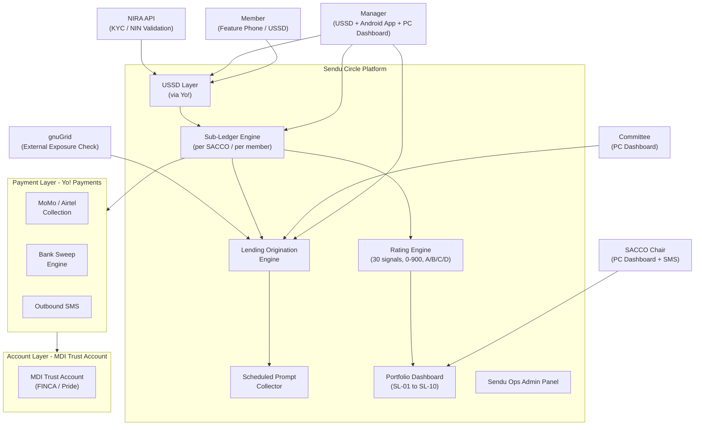

# Sendu Circle MVP - Research Summary

**Document:** Circle MVP System Blueprint v4.0  
**Date:** 23 March 2026  
**Author:** Byron Biroli  
**Entities:** Bikede Technologies Ltd (UK HoldCo) / Sendu Uganda Ltd (OpsCo)  
**Scope:** 6-Month SACCO Pilot, Uganda

---

## 1. What Is This?

Sendu Circle is a **digital savings group management and lending infrastructure platform** targeting SACCOs (Savings and Credit Cooperative Organisations) in Uganda. It is a fintech product designed to modernise how informal savings groups collect contributions, manage member records, originate loans, and track repayments — all within a regulatory and payment framework that fits Uganda's Tier 4 microfinance landscape.

Think of it as the operating system for a SACCO: it digitises everything from cash collection to credit scoring, but the SACCO itself remains the bank — providing capital, making lending decisions, and bearing risk. Sendu provides only the infrastructure layer.

---

## 2. The Problem Being Solved

Uganda has thousands of SACCOs operating at a community level, many of which:
- Run on paper ledgers or informal spreadsheets
- Have no systematic way to credit-score their members
- Cannot detect cross-borrowing (members holding loans from MTN MoKash, Airtel Wewole, or other MFIs simultaneously)
- Lose track of cash contributions between field collection and bank deposit
- Have no visibility into portfolio health (PAR, collection efficiency, concentration risk)

Sendu Circle addresses all of these without displacing the SACCO — it amplifies their capacity rather than replacing them.

---

## 3. Key Entities and Their Roles

| Entity | Role |
|---|---|
| **Sendu Uganda Ltd** | Technology provider. Builds and operates the Circle platform. No fund holding. No payment licence required. |
| **SACCO** | The bank. Provides capital, makes lending decisions, bears credit risk. Licensed under UMRA (Tier 4). |
| **MDI (FINCA / Pride Microfinance)** | Holds the trust account. Named on all bank and Yo! merchant accounts. Tier 3, BoU-licensed. |
| **Yo! Uganda Ltd** | Sole payment integration partner. Handles USSD sessions, MoMo/Airtel collection, bank sweeps, and outbound SMS. |
| **NIRA** | Uganda's National Identification and Registration Authority. Provides NIN validation API for KYC. |
| **gnuGrid** | Third-party credit exposure bureau. Used to detect telco loan and MFI cross-borrowing before a loan is approved. |
| **CRB** | Credit Reference Bureau. Negative reporting triggered on default; positive reporting for clean repayment records. |

---

## 4. System Architecture Overview

### Three-Layer Payment Architecture

- **Payment Layer (Yo!):** Collects mobile money from members; sweeps to trust account; processes loan disbursements.
- **Account Layer (MDI):** Holds the trust account. Named account holder throughout. Sendu has no access to or claim over funds.
- **Ledger Layer (Sendu):** Manages the sub-ledger. One sub-account per SACCO, one entry per member per cycle. Tracks expected vs actual, runs the rating engine and lending records.

---

## 5. User Types and Channels

| User | Device | Channel | Primary Role |
|---|---|---|---|
| Member | Feature phone | USSD + SMS | Check balance, submit loan application, confirm payment prompts |
| Manager | Feature phone + Android + PC | USSD + Android App + PC Dashboard | Run reconciliation sessions, record cash, log bank deposits, originate loans |
| SACCO Chair | Any | SMS + PC Dashboard | Final loan approval authority, portfolio view |
| Committee Member | Any | SMS + PC Dashboard | Vote on loan applications |
| Sendu Ops | PC | Admin Panel | Monitor across all SACCOs, handle escalations |

The **Android App** is the field companion (cash entry, reconciliation session open/close, bank deposit logging). The **PC Dashboard** is the management interface (reporting, portfolio, loan management, audit). They share the same data layer.

---

## 6. Contribution and Collection Flow

Members can contribute in two ways:
1. **Digital:** Push MoMo or Airtel Money to a Yo! merchant reference. Yo! confirms in real-time to the sub-ledger.
2. **Cash:** Hand cash to the manager at a group meeting. Manager enters the amount on the Android app (PIN required).

Both streams feed the same member-level ledger entry. Rating signals are calculated on combined totals — a consistent cash payer scores the same as a consistent digital payer.

### Reconciliation Session Protocol

This is the core control point:
1. Manager opens a session on the dashboard with PIN.
2. Reviews each member's deposit entry (expected vs actual, pre-populated before cycle).
3. Confirms attribution or flags exceptions. Session cannot close with unresolved entries.
4. Manager closes session with PIN again.
5. Sendu sends summary SMS to manager and individual SMS to each member.
6. Sendu fires a sweep instruction to Yo! within 15 minutes.
7. Yo! settles to MDI trust account within 1 business day.
8. Sendu confirms bank credit. All entries flip to `Settled / Available`.

Funds only reach `Settled / Available` after all three conditions are met: Yo! confirmation, manager reconciliation, and bank settlement.

---

## 7. KYC and Identity

The MVP uses a single **Lite KYC** tier:
- National ID Number (NIN) entered via USSD
- NIRA API validates NIN in real-time and returns full name, date of birth, gender, and photo
- Fingerprint captured using a ZKTeco ZK9500 scanner at the first group meeting
- Two fingers stored (~500 bytes each per template)
- If scanner is unavailable, member proceeds NIN-only and is flagged for biometric capture at next meeting

---

## 8. Credit Rating Engine (MVP)

The rating engine is one of the most sophisticated components. It operates on **30 behavioural signals** across **7 groups**, producing a score on a 0-900 scale across four bands:

| Band | Score | Meaning |
|---|---|---|
| A | 700–900 | Low risk |
| B | 500–699 | Moderate risk |
| C | 350–499 | Higher risk |
| D / Disqualified | <350 or hard filter | Ineligible |

### Signal Groups

1. **Savings Behaviour (29%):** Contribution consistency, amount consistency, peer comparison, savings trajectory, prompt response rate, digital vs cash mix.
2. **Repayment Behaviour (25%):** On-time rate, completeness, cure rate, days-to-cure, channel consistency. *Activates only after first loan.*
3. **Trust Account & Reconciliation (8%):** Expected vs actual match, settlement speed, manager discipline (internal signal).
4. **Financial Behaviour (14%):** Loan-to-savings ratio, contribution-while-borrowing, withdrawal frequency, balance maintenance.
5. **Early Warning Indicators (6%):** Cash-in decline, missed prompt spike, withdrawal ratio spike, timing shift, airtime cessation.
6. **External Validation (11%):** gnuGrid exposure status, guarantor network quality, SIM tenure, airtime CV.
7. **SSI / Macro Signals (7%):** Calendar stress (school fees, Ramadan, harvest seasons), macro stress flag (UGX depreciation, fuel prices), regional agricultural adjustment.

**Pre-lending weight redistribution:** Before the first loan, Group 2 (Repayment, 25%) is redistributed to Savings (+15%), Financial Behaviour (+5%), and External Validation (+5%). Weights transition back to target over 90 days once lending data accumulates.

### Hard Filters (instant disqualification)
- gnuGrid hard decline (external exposure above threshold X)
- Active negative CRB listing
- Third novation exhausted and uncured (within 6 months)
- 5+ PIN failures in a single session

---

## 9. gnuGrid Pre-Scoring Gate

gnuGrid is a third-party service that detects whether a member already holds loans with MTN MoKash, Airtel Wewole, or other registered lenders in Uganda. It is the only mechanism available for this in Uganda today.

The check fires automatically on loan application submission. The result determines whether the application proceeds and whether a loan limit cap is applied:

- **Clean:** Proceed, no adjustment.
- **Moderate exposure:** Proceed, cap limit at 80%.
- **High exposure:** Proceed, cap at 50%, alert committee.
- **Hard decline:** Application blocked, member notified.

Initial thresholds (to be calibrated during pilot): Y = UGX 200,000, X = UGX 1,000,000.

---

## 10. Lending Architecture

SACCO capital lending is in scope from Day 1 of the pilot. The SACCO is always the lender — Sendu only provides the origination infrastructure.

### Loan Lifecycle

```mermaid
flowchart LR
    Application["Member submits\nloan application\n(USSD)"]
    gnuGrid_Check["gnuGrid\nexposure check"]
    Rating_Snap["Rating snapshot\ntaken"]
    Committee["Committee\nvotes / decides"]
    Disburse["Manager disburses\n(Yo! or cash, PIN required)"]
    Schedule["Repayment schedule\ngenerated"]
    Prompts["Scheduled prompts\nfire on due dates"]
    Repayment["Member confirms\npayment via PIN"]
    Novation["Missed? Novation\n1 → 2 → 3"]
    CRB_Report["CRB negative\nreport filed"]

    Application --> gnuGrid_Check --> Rating_Snap --> Committee --> Disburse --> Schedule --> Prompts --> Repayment
    Repayment -->|"missed"| Novation --> CRB_Report
```

### Novation Framework (Late Payment Escalation)
- **Novation 1:** Missed due date + grace period. 2–3% fee added. New 14-day window. Member notified.
- **Novation 2:** Novation 1 expires. Fee added. Member and guarantors notified.
- **Novation 3:** Novation 2 expires. Fee added. Manager and Chair notified.
- **Novation 3 expired uncured:** CRB negative report filed.

Novation fees split: 70% to SACCO, 30% to Sendu.

### Scheduled Prompt Collection
Rather than relying on members or managers to initiate every payment manually, Sendu fires Yo! collection requests at scheduled times. The member receives a USSD/push prompt and enters their PIN to approve. If no response within 4 hours, the payment is logged as missed and grace period begins.

---

## 11. SACCO-Level Portfolio Signals

Ten portfolio-level signals (SL-01 to SL-10) score the health of the SACCO's lending book. These are displayed on the manager and chair dashboards and stored for bank partner presentations:

- Portfolio concentration (top 5 borrowers as % of book)
- Sector concentration
- Collection efficiency
- PAR7 and PAR30 trends
- Approval quality (default rate of recent loans)
- Guarantor coverage
- Liquidity ratio
- Loan tenor drift
- Committee override rate

Alert thresholds trigger dashboard warnings. No automated enforcement — the SACCO decides how to respond.

---

## 12. Business Model

Sendu earns revenue from:

1. **Lending interest revenue share (primary):** 5–15% of interest collected on Circle-originated loans, tiered by SACCO size. Calculated on cash basis at cycle end.
2. **Novation fee split:** 30% of late payment fees (2–3% per event, max 3 novations per loan).
3. **Platform fee (post-pilot, Month 7+):** Flat monthly fee, tiered by SACCO size — UGX 100,000 to 800,000+ (~$26–$210+/month).
4. **Add-on services:** CRB lookups (UGX 400/check), NIN verification (UGX 500/check), data exports (UGX 50,000/export).

**No setup fee. No hardware charge. No platform fee during the 6-month pilot.** This is designed to reduce friction at SACCO onboarding and demonstrate value before billing.

Rating is included within the Circle platform — it is not a separate charge at this stage.

---

## 13. Security Architecture

The security model is deliberately pragmatic for the pilot phase. Key controls:

- **Member authentication:** 4-digit PIN via USSD. Lockout after 3 failures. Reset via OTP SMS.
- **Manager (PC):** Username + password (10+ chars, 90-day rotation). HTTPS only. CSRF protection. 15-min session timeout.
- **Manager (Android):** PIN + device binding. Encrypted local storage. Signed APK.
- **Sendu Ops:** Username + password + TOTP MFA. IP allowlisting. Full audit logging.
- **Data at rest:** AES-256 (PostgreSQL). Fingerprint templates encrypted.
- **Data in transit:** TLS 1.3.
- **PINs:** bcrypt + salt. Never stored in plaintext, never in SMS.
- **Infrastructure:** AWS af-south-1 (Cape Town). VPC with private subnets for DB. Least-privilege security groups.
- **Backups:** Daily automated. Encrypted to AWS S3 af-south-1. RPO 24 hours, RTO 4 hours.
- **API security:** HMAC-SHA256 on sweep instructions. Shared secret webhook verification. API keys in environment variables. 90-day rotation.
- **Fraud detection (MVP):** Heuristic rules only (duplicate transactions, reconciliation anomalies, velocity spikes, dormant account activation, cash entry anomalies). ML-based detection deferred.

**Accepted MVP risks:** No penetration testing, no biometric access authentication (Smile ID/Daon deferred), no automated multi-signature tooling (manual 2-of-3 via WhatsApp), no ISO 27001 or SOC 2.

**Legal flag:** DPPA compliance for hosting in AWS af-south-1 (South Africa) requires formal legal review before production deployment. Budget allocated in the $150k compliance/legal line item.

---

## 14. Regulatory Position

- **SACCOs:** Tier 4 institutions under UMRA (Tier 4 Microfinance Institutions and Money Lenders Act 2016). Licensed to accept deposits and lend to members. No bank agent regulations apply — SACCOs are principals acting on their own behalf.
- **Sendu:** Operates as a technology services provider under a Technology Services Agreement (TSA). No payment services licence required for MVP.
- **MDI (FINCA / Pride):** Tier 3, BoU-licensed. Holds the trust account. Named on all financial accounts.
- **Yo! Payments:** Licensed payment aggregator under the NPS Act 2020.
- **PDPO registration:** Sendu Uganda Ltd must register with Uganda's Personal Data Protection Office before production deployment. COO is designated Data Protection Officer.

---

## 15. Technology and Integration Dependencies

| Component | Provider | Notes |
|---|---|---|
| USSD sessions | Yo! Uganda Ltd | Session delivery, menu rendering, callbacks |
| MoMo / Airtel collection | Yo! Uganda Ltd | Pay-ins via merchant account registered to MDI |
| Bank sweep | Yo! Uganda Ltd | UGX 4,000 per sweep to MDI trust account |
| Outbound SMS | Yo! Uganda Ltd | UGX 35–50 per SMS depending on volume |
| KYC / NIN validation | NIRA API | UGX 500 per check (post-pilot add-on) |
| Biometrics | ZKTeco ZK9500 | Physical scanner. Manager-operated at group meetings |
| Credit exposure | gnuGrid | API check on each loan application |
| CRB reporting | Credit Reference Bureau | Negative on Novation 3 expiry; positive for clean records |
| Database | PostgreSQL | AES-256 at rest |
| Hosting | AWS af-south-1 | Cape Town, South Africa |
| Backups | AWS S3 af-south-1 | Encrypted, separate from production |

---

## 16. Development Sequence (v4.0 Additions)

The core v1.0 system (USSD flows, basic Circle product, 6-signal rating, KYC, data model) is the foundation. v4.0 adds:

- Lending origination flow (USSD + dashboard)
- Committee decision recording
- Disbursement processing (Yo! + cash with PIN)
- Repayment schedule generator
- Scheduled prompt scheduler (Yo! collection API)
- Repayment prompt engine
- Novation engine (automated triggers, fee calculation, escalation to CRB)
- Portfolio dashboard (SL-01 to SL-10)
- gnuGrid API integration
- SSI lookup table and modifier engine
- SACCO instance configuration
- Loan SMS templates
- CRB reporting integration
- Expanded data model (loan_application, committee_decision, disbursement, repayment_schedule, repayment, sacco_config, sacco_portfolio_signal, scheduled_prompt tables)

---

## 17. My Assessment

### What is well-designed

**The three-layer architecture is clean.** By keeping Sendu as pure technology (no fund holding, no merchant account, no payment licence), the regulatory exposure is minimised and the liability structure is clear. The MDI holding all funds and being named on all accounts is the correct structure for a Tier 4 SACCO context.

**The rating engine is sophisticated for an MVP.** 30 signals across 7 groups is not a minimum viable product — it is a complete behavioural credit scoring framework. The weight redistribution logic (redistributing repayment group weights before lending data exists) shows careful thinking about cold-start problems in credit scoring. The gnuGrid pre-gate integration is particularly well-considered given the opacity of the Ugandan credit market for thin-file borrowers.

**The reconciliation session protocol is the right abstraction.** Making the manager's reconciliation the single control point for fund movement — requiring PIN at open and close, locking all confirmed entries, triggering the sweep automatically — is operationally sound and auditable.

**The novation framework is elegant.** Three escalation steps with fees, guarantor notification, and eventual CRB reporting creates the right incentive gradient without being immediately punitive. The 70/30 split between SACCO and Sendu on novation fees aligns incentives correctly — Sendu earns more when the SACCO recovers loans, not when they default.

**The business model aligns incentives.** Revenue tied primarily to interest collected (cash basis) means Sendu only earns when SACCOs are successfully lending and collecting. The free pilot removes the adoption barrier.

### Areas of technical risk

**Single payment provider dependency.** Yo! Uganda Ltd is the sole integration partner for USSD, collection, sweeps, and SMS. Any Yo! downtime, rate change, or commercial dispute creates a single point of failure across all SACCOs on the platform. Mitigation (e.g., a secondary USSD or SMS provider) is explicitly out of scope for MVP but should be on the roadmap.

**The scheduled prompt scheduler is operationally complex.** Firing individual Yo! collection API requests for every member across every SACCO on every scheduled date — and handling callbacks, timeouts, retries, and signal generation — is a non-trivial distributed systems problem. The document outlines the requirements correctly but the implementation will need careful engineering around idempotency and failure handling.

**AWS af-south-1 hosting has an unresolved legal dependency.** The document explicitly flags that DPPA compliance for cross-border data storage (Uganda data hosted in South Africa) requires a formal legal opinion before production deployment. This is the right flag to raise, but it is a hard prerequisite — not a post-launch item.

**The Android app device binding creates operational friction.** One device per manager, with re-registration requiring Sendu Ops involvement, will generate support load as managers change phones, lose devices, or switch handsets. This is manageable at pilot scale but needs a clear ops protocol.

**Manual multi-signature for float movements is a process risk.** The 2-of-3 co-founder approval via WhatsApp for bank float movements is explicitly listed as an accepted MVP risk. This works at three people, but it creates a single-process dependency on co-founder availability and discipline.

### What this tells us about the broader system (Invoicly context)

This document describes an entirely separate product from Invoicly — it is a SACCO management and micro-lending platform for Uganda, not an invoicing or billing system. The two products appear to sit within the same entrepreneurial ecosystem (same people, same company structure) but are architecturally and commercially independent.

The Invoicly codebase (Laravel + Sanctum API, with a WordPress plugin) is likely the commercial invoicing product, while Sendu Circle is the SACCO fintech product. The overlap may be in the shared team and potentially in shared infrastructure or API patterns, but there is no direct dependency described between the two.

---

*Research completed: 7 April 2026*
